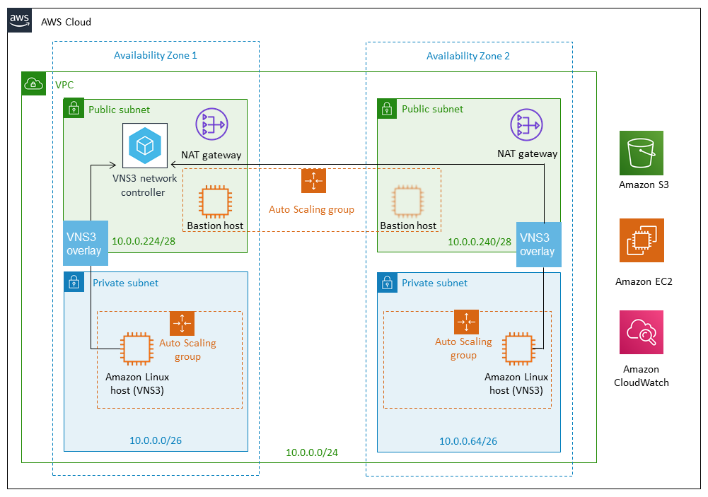

# Encrypted Overlay Quickstart with Cloudformation

## [Quickstart Repo](https://github.com/cohesive/quickstart-cohesive-vns3)

## About
This [Quick Start](https://aws.amazon.com/quickstart/architecture/cohesive-networks-vns3/) deploys a Cohesive Networks VNS3 overlay network on the AWS Cloud in about 15 minutes, following best practices from AWS and Cohesive Networks. It helps organizations with sensitive and regulated workloads in verticals such as healthcare and life sciences, financial services, power and utilities, retail, and hospitality.

This Quick Start also includes a security controls reference for use cases that fall within the scope of the U.S. Health Insurance Portability and Accountability Act (HIPAA). It addresses certain technical requirements in the Privacy, Security, and Breach Notification Rules (45 C.F.R. Parts 160 and 164) under the HIPAA Administrative Simplification Regulations.

This Quick Start is for users interested in a generalized method for encrypting all data in motion between Amazon Elastic Compute Cloud (Amazon EC2) instances, connecting AWS virtual private clouds (VPCs) securely to other networks, and securing traffic with firewalling and network function virtualization.

## Architecture

