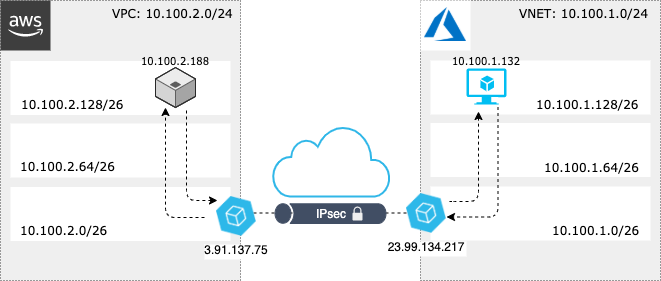

# Simple Multi-Cloud Architecture AWS <-> Azure
This topology is a simple IPsec connection between VNS3 controllers running in an AWS VPC and an Azure VNET. Routing and Policies are configured
such that the cloud bridge effectively extends the private network in each cloud.

## API Configuration Steps
After infrastructure is provisioned, network connectivity and policies can be configured via the API:

1. License your controllers
2. Generate keysets for your controllers
3. Create an IPsec endpoint and tunnel for each controller
4. Add a route on each controller for the network CIDR in the other cloud

Here's an [example](https://github.com/cohesive/python-cohesivenet-sdk/blob/master/examples/multicloud_aws_azure.py) using our Python SDK with some helper functions.

[View our Latest API Specification Here](https://docs.cohesive.net/apis/vns3/v/).

## Architecture

