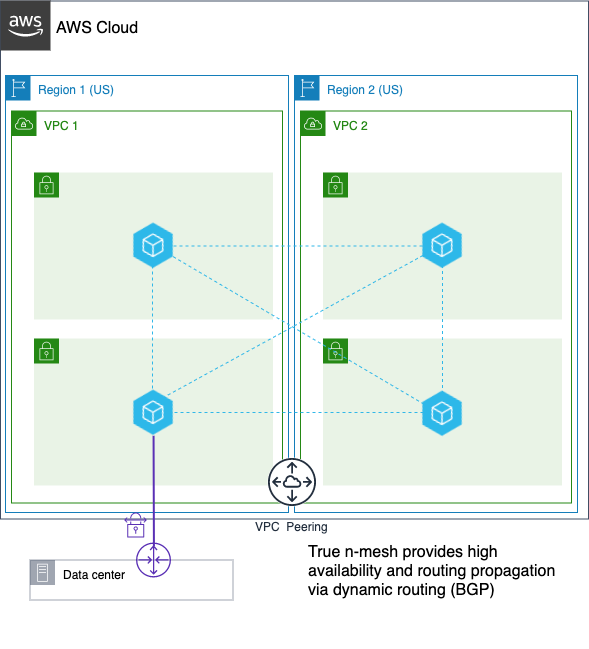

# Basic VNS3 Peering Mesh for High Availability
This topology is a basic 4-way peering mesh between 4 VNS4 Controllers. Each controller is peered via an
encrypted TLS connection, over which dynamic routing is running using BGP. This allows for highly available routing between
the peered regions in the case of availability zone failure as traffic will automatically reroute.

## API Configuration Steps
After infrastructure is provisioned, network connectivity and policies can be configured via the API:

1. License your root controller
2. Generate keyset on root controller
3. For each peer, fetch licensing and keyset from the root controller
4. For each controller in mesh, set its peer ID  (1,2,3 and 4)
5. For each controller in mesh, add the other controllers as peers.

Here's an [example](https://github.com/cohesive/python-cohesivenet-sdk/blob/master/examples/peering_mesh.py) using our Python SDK with some helper functions.

[View our API Specification Here](https://docs.cohesive.net/apis/vns3/v/4.8).

## Architecture
Note: IPsec site-to-site VPN to a datacenter shown for demonstration purposes, it is not reflected in the terraform.

